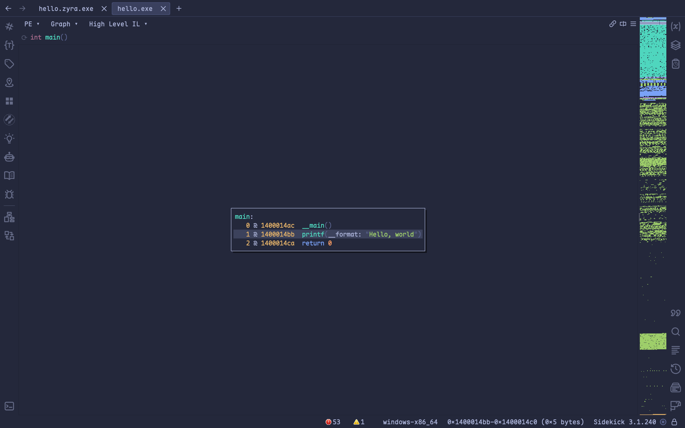

# ZYRA: Your Runtime Armor 🛡️

ZYRA is a Zig-based obfuscator, packer, and loader designed to protect executable files from static analysis and reverse engineering.

- ✨ Written in Zig for performance and control
- 👌 Easy to install with one-liner command
- 🔄 Generate a much more complicated control flow for packed binary to anti-reversing
- 🛡️ Provides runtime decryption and execution, shielding payloads from inspection

## Showcase

If you wonder the effectiveness of ZYRA, you should check this simple "hello world" binary out. In the following example, I'm gonna use Binary Ninja as the decompiler. You can get the example binaries in [examples](./examples/).

Before using ZYRA, we can see that it's as simple as f\*\*k to reverse engineer.



But after ZYRA, it's much more complicated! You can see the control flow graph is so complicated to trace (but it's not perfect yet).


## Installation

ZYRA is now currently support Linux only, but the Windows version will be released soon.

You can simply copy and paste the following one-liner to install ZYRA.

```bash
bash <(curl -sSL https://raw.githubusercontent.com/CX330Blake/ZYRA/main/install.sh)
```

> [!WARNING]  
> Never execute any untrusted script on your machine. Read the script first.

## Workflow under the hood

1. Generate the embedded stub (generate_embedded_stub.zig)
2. Encrypt the payload (src/main.zig)
3. Embed & pack jthose payload in stub (src/packer/packer.zig)
4. Decrypt and execute in runtime (src/packer/elf_stub.zig)

## Packed binary structure

| Section                   | Description        |
| ------------------------- | ------------------ |
| ELF STUB BINARY           | The "outer" binary |
| "PAYLOAD_START_MARKER"    | Payload begin      |
| payload_len (u64 LE)      | -                  |
| key (u8)                  | Decrypt key        |
| encrypted_payload (bytes) | -                  |

## To-Do

1. Add support for anti-debugging.
2. Add more advanced techniques.

    - Encryption
        - RC4
        - ChaCha20
        - TEA
        - etc
    - Packing

        - Run-length encoding
        - LZ77
        - Huffman coding
        - etc

   - Obfuscation
        -

## Contribution

This project is maintained by [@CX330Blake](https://github.com/CX330Blake/). PRs are welcome if you also want to contribute to this project.
